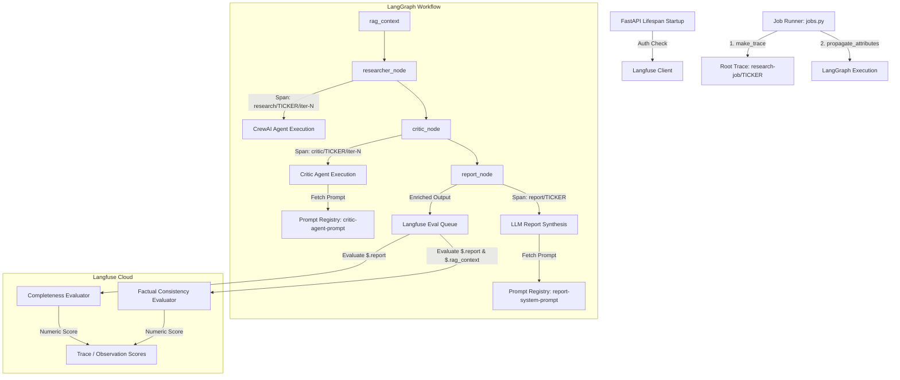

# Langfuse Integration Guide

This document outlines the architecture, trace flow, and configuration details for the Langfuse observability and evaluation integration in the **Stock Market Researcher** application.

---

## Architecture Overview

Langfuse is integrated into the backend stack to trace agent executions, monitor LLM performance, track cost/latency, manage system prompts, and run automated evaluations (LLM-as-a-Judge).



---

## 1. Core Integration & Client Initialization

The Langfuse integration is managed via a dedicated module:
📂 [backend/observability/langfuse_client.py](file:///d:/Code/StockResearcher/StockMarketResearcher/backend/observability/langfuse_client.py)

### Monkeypatching for Compatibility
To ensure seamless integration with dependencies (like LiteLLM and OpenInference), `langfuse_client.py` performs key monkeypatches:
1. **Init patch**: Removes the unsupported `sdk_integration` parameter injected by LiteLLM during startup.
2. **Version patch**: Dynamically populates `langfuse.version` to prevent AttributeError.
3. **Trace patch**: Supports legacy v2 `trace()` calls, wrapping them into the newer v3/v4 observation model.

### Connection & Lifespan Verification
At backend startup, the FastAPI lifespan verifies authentication with Langfuse:
📂 [backend/main.py](file:///d:/Code/StockResearcher/StockMarketResearcher/backend/main.py)
```python
from observability.langfuse_client import get_langfuse_client
lf = get_langfuse_client()
if lf.auth_check():
    logger.info("[Langfuse] Auth check passed")
```

---

## 2. Trace Lifecycle & LangGraph Propagation

Traces are initialized at the background job level:
📂 [backend/jobs/jobs.py](file:///d:/Code/StockResearcher/StockMarketResearcher/backend/jobs/jobs.py)

1. **Root Trace Generation**:
   A deterministic trace ID is created using the background `job_id` seed.
   ```python
   trace = make_trace(
       name=f"reasearch-job/{ticker}",
       ticker=ticker,
       job_id=job_id,
       tags=["stck-research", ticker.lower()],
       metadata={"job_id": job_id},
   )
   ```
2. **Trace ID Propagation**:
   The `trace_id` is passed as metadata to the LangGraph runner config:
   ```python
   async for chunk in graph.astream(initial_state, config={"metadata": {"langfuse_trace_id": trace_id}}):
       # Process nodes...
   ```
3. **Attribute Propagation**:
   Tags and user contexts are propagated to sub-observations using Langfuse's context manager:
   ```python
   with propagate_attributes(tags=["stck-research", ticker.lower()]):
       # Graph execution context
   ```

---

## 3. Node-Level Instrumentation

### A. Researcher Node
📂 [backend/graph/workflow.py](file:///d:/Code/StockResearcher/StockMarketResearcher/backend/graph/workflow.py)
Starts a span called `research/{ticker}/iter-{iteration}` and runs the CrewAI agents. Span status updates based on the outcome of the Crew kickoff.

### B. Critic Node
📂 [backend/graph/workflow.py](file:///d:/Code/StockResearcher/StockMarketResearcher/backend/graph/workflow.py)
1. Fetches the prompt definition `critic-agent-prompt` dynamically from the Langfuse Prompt Registry.
2. Traces the specific prompt version used by wrapping the execution in `propagate_attributes(prompt=critic_prompt)`.
3. Emits span `critic/{ticker}/iter-{iteration}` recording input metrics, output critique markdown, and approved status.

### C. Report Node (Enriched for Evaluations)
📂 [backend/graph/report.py](file:///d:/Code/StockResearcher/StockMarketResearcher/backend/graph/report.py)
Fetches the `report-system-prompt` from Langfuse. When report generation completes, it enriches the observation's output payload to support downstream evaluations:

```python
rag_context_text = "\n\n---\n\n".join(rag_context) if rag_context else ""
eval_output = {
    "signal": signal,
    "confidence": confidence,
    "report": full_report,           # Mapped to {{output}} in evaluators
    "rag_context": rag_context_text, # Mapped to {{rag_context}} in evaluators
}
span.update(output=eval_output)
```

---

## 4. LLM-as-a-Judge Automated Evaluations

Two observation-level evaluators are configured in the Langfuse Console to evaluate reports automatically upon ingestion.

### A. Report Completeness (`report-completeness`)
- **Target**: `SPAN` observations where `Name` matches `report/*` or `Metadata.node` = `report`.
- **Score Type**: Numeric (0 to 1).
- **Judge Model**: `gemini-2.5-flash` or `mistral-small-2503`.
- **Variables**: `{{output}}` mapped to Observation Output → JSONPath `$.report`.
- **Criteria**: Checks for presence of Executive Summary, Price Analysis, News Sentiment, Fundamentals Snapshot, Signal/Confidence, Risk Factors, and Recommendation.

### B. Factual Consistency / Hallucination Detection (`factual-consistency`)
- **Target**: `SPAN` observations where `Name` matches `report/*` or `Metadata.node` = `report`.
- **Score Type**: Numeric (0 to 1).
- **Judge Model**: `gemini-2.5-flash` or `mistral-small-2503`.
- **Variables**:
  - `{{output}}` mapped to `$.report`
  - `{{rag_context}}` mapped to `$.rag_context`
- **Criteria**: Checks all numeric and financial claims in the report against the raw context. Automatically scores `1.0` if RAG context is empty (safe fallback during development phases where RAG is disabled).

---

## 5. Configuration & Environment Variables

Make sure the following variables are configured in your backend `.env` file:

```ini
# Langfuse credentials
LANGFUSE_PUBLIC_KEY="pk-lf-..."
LANGFUSE_SECRET_KEY="sk-lf-..."
LANGFUSE_HOST="https://cloud.langfuse.com" # Or your self-hosted URL
```
